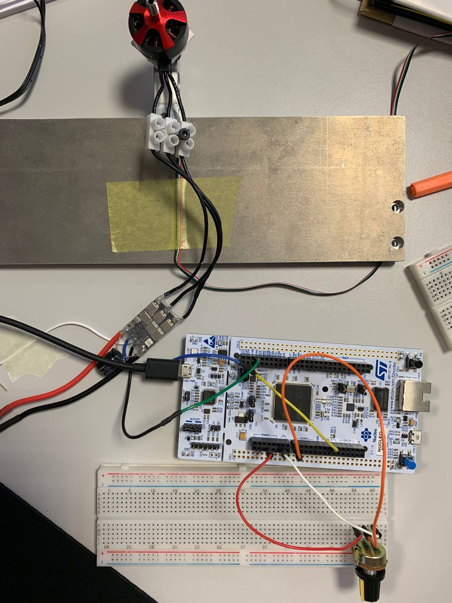

# Get started on Linux
## Requirements
- Rust (Rust Compiler was version 1.76.0 at time of development)
- STM32 micro-controller (in this project I used [this stm32f7](https://os.mbed.com/platforms/ST-Nucleo-F767ZI/))
- One potentiometer to control the duty cycle 
- Esc with pre-installed firmware (generally a variation of BLHeli)
- An appropriate brushless DC electric motor

## Classic Installation
```bash
# Install Linux Requirements
sudo apt update
sudo apt install build-essential cmake pkg-config libssl-dev libudev-dev curl
# Install and source Rust with Cargo
curl https://sh.rustup.rs -sSf | bash -s -- -y
source $HOME/.cargo/env
# Install Rust dependencies for generic stm32 development
rustup update
rustup component add llvm-tools-preview
cargo install cargo-binutils cargo-expand cargo-generate
cargo install probe-rs --features cli
# Depending of the machine architecture intall the appropriate compilation target
rustup target add thumbv7em-none-eabihf # for Cortex-M7F (with FPU)
# Linux General Dependencies for stm32 development
sudo apt-get install gdb-multiarch openocd qemu-system-arm
```
Finally clone this repository

```bash
git clone https://github.com/CatInTheRain/rust-BLDC-stm32.git
```

## Docker Installation (Alternative)
Clone this repository
```bash
git clone https://github.com/CatInTheRain/rust-BLDC-stm32.git
```
build the docker image
```bash
./docker/build.sh
```
and finally run the container
```bash
./docker/go.sh
```
The repository will be mounted inside the docker container, (every modification in the docker image will be also in the local package).

## Build the project

Now you can compile the package and all of its dependencies
```bash
git clone https://github.com/CatInTheRain/rust-BLDC-stm32.git
cd rust-BLDC-stm32
cargo build
# or if you want to build the release version
cargo build --release
```

# Pinout of this Project
| Header stm32 | <---> color |      Header HW     | Function |
|:------------:|:-----------:|:------------------:|:--------:|
|     3.3V     |     red     |  VCC Potentometer  |          |
|      GND     |    white    |  GND Potentometer  |          |
|      PA3     |    orange   | Wiper Potentometer |    ADC   |
|      GND     | black/green |       GND ESC      |          |
|      PE5     | blue/yellow |     Signal ESC     |    PWM   |

For this project, I used a 4S LiPo battery which has 4 cells and that’s 16.8V when it is charged. 




# Flash this project

If you have the same board of this project you can simply connect the STM32 to the PC and run

```bash
cargo flash --release --chip STM32F767ZITx
```
> If you have another board you can follow the readme [here](#how-to-setup-the-project-according-to-a-different-stm32) to set the config files.

---

# Project Explanation
The task of this project is to control the speed of the brushless motor of zero to maximum using the potentiometer. In addition, if the user button is pushed the pwm generator will be disabled by an interrupt: in this way the motor will stop. The software routine can be restored by the reset button.

The application was created leveraging the STM32F767ZI microcontroller on the Nucleo-144 development board. All code was created at the HAL level using the stm32f7xx Rust HAL.

The following video demonstrates this task.

https://github.com/CatInTheRain/rust-BLDC-stm32/assets/55113554/2415d398-1e7d-4431-9319-9d9dbee1cc24

The final code is `src/main.rs` and it uses **Real-Time Interrupt-driven Concurrency (RTIC)** framework. In fact in this code there are two interrupt service routines: one that respondes to a button press event and another that respondes to a timer interrupt for the generation of the PWM signal. Interrupts are not safe by definition since they introduce race conditions. As a result, since Rust follows a singleton pattern, *global mutable data* and *peripherals handle* need to be wrapped in safe abstractions that allow them to be shared between the ISRs (Interrupt Service Routines). The programming language will guarantee that race condition will not be triggered.

In the directory `examples/` you can find some public examples to study the differences between using and not using RTIC framework.  Let's compare two basic codes, highlithing how it is possible to access to a global shared variable.

```rust
#![no_std]
#![no_main]

// use declarations 
use core::cell::RefCell;
use cortex_m::interrupt::Mutex;
use cortex_m_rt::entry;
use cortex_m::asm;
use panic_halt as _ ;
use stm32f7xx_hal::{
    gpio::{self, Output, PushPull},
    pac::{self, interrupt, TIM2},
    prelude::*,
    timer::{CounterUs, Event},
};

// Create alias for Led pin
type LedPin = gpio::PB7<Output<PushPull>>;

// Create a Global Variable for the LED GPIO Peripheral and for the Timer that I'm going to pass around.
static G_LED: Mutex<RefCell<Option<LedPin>>> = Mutex::new(RefCell::new(None));
static G_TIM: Mutex<RefCell<Option<CounterUs<TIM2>>>> = Mutex::new(RefCell::new(None));

// main thread
#[entry]
fn main() -> ! {
  // Setup Clock and Peripheral devices
  let dp = pac::Peripherals::take().unwrap();
  let rcc = dp.RCC.constrain();
  let clocks = rcc.cfgr.sysclk(216.MHz()).freeze();

  // Set timer interrupt
  let mut timer = dp.TIM2.counter_us(&clocks);
  timer.start(2000.millis()).unwrap();
  timer.listen(Event::Update);

  // Configure Led pin as a push pull output
  let gpiob = dp.GPIOB.split();
  let led = gpiob.pb7.into_push_pull_output();

  // Enable the timer interrupt in the NVIC 
  unsafe {
      cortex_m::peripheral::NVIC::unmask(interrupt::TIM2);
  }

  // Move peripherals in global context
  cortex_m::interrupt::free(|cs| {
      G_TIM.borrow(cs).replace(Some(timer));
      G_LED.borrow(cs).replace(Some(led));
  });   

  // Application Loop
  loop {
    cortex_m::interrupt::free(|cs| {
      let mut led = G_LED.borrow(cs).borrow_mut();
      led.as_mut().unwrap().set_high();
    });
    asm::delay(1_000_000); // sleep for some time (1'000'000 clock cycles)
  }
}

// Timer Interrupt Routine
#[interrupt]
fn TIM2() {
    cortex_m::interrupt::free(|cs| {
        // Obtain Access to Led Global Data and Turn Off
        let mut led = G_LED.borrow(cs).borrow_mut();
        led.as_mut().unwrap().set_low();

        // Obtain access to Global Timer Peripheral and Clear Interrupt Pending Flag
        let mut timer = G_TIM.borrow(cs).borrow_mut();
        timer.as_mut().unwrap().clear_interrupt(Event::Update);
    });
}

```
In this example we use a `Mutex<RefCell<>>` to safely share peripheral access and ensure that only one reference to a peripheral is given out at a time (runtime check).

Also it must be noted that unmasking interrupts with the STM32 Nested Vectored Interrupt Controller (NVIC) is considered unsafe in Rust.

Our shared variable is a Mutex around a RefCell and it ensures we only have access during a *critical section*, and therefore makes the variable *Sync* (a type that is safe to share between threads), even though a plain RefCell would not be *Sync*. The `cs` token can safely be generated by the closure `interrupt::free`; this guarantee is provided statically by the compiler. In this critical section of code, preemption from interrupts is disabled to ensure that the accessing the global variable does not introduce any race conditions. Finally, thanks to the token `cs` it is possible to `borrow()` on the mutex, which gives a reference to the RefCell, and also it is possible to obtain a mutable reference to the shared resource with `borrow_mut()`.

It is not possible to use only Mutex (e.g. `static G_LED: Mutex<Option<LedPin>> = Mutex::new(None);`) because Mutex in bare-metal applications does not implement `borrow_mut()` to prevent undefined behaviour, as you can see in [this issue](https://github.com/rust-embedded/bare-metal/issues/16).

This mechanism introduces high degree of verbosity to the code, even if it offers safety guarantees (there is also an `unsafe` block in the code). Let's see the same code ported on RTIC framework:

```rust 
#![deny(unsafe_code)]
#![no_main]
#![no_std]

// RTIC require the #[app] attribute to make sure that the device points to a Peripheral Access Crate (PAC)
#[rtic::app(device = stm32f7xx_hal::pac, peripherals = true)]
mod app {
  // use declarations 
  use cortex_m::asm;
  use panic_halt as _;
  use stm32f7xx_hal::{
      gpio::{self, Output, PushPull},
      pac::TIM2,
      prelude::*,
      timer::{self, Event},
  };

  // Resources shared between tasks
  #[shared]
  struct Shared { led: gpio::PB7<Output<PushPull>>, }

  // Local resources to specific tasks (cannot be shared)
  #[local]
  struct Local { timer: timer::CounterUs<TIM2>, }

  // init task setting up the system
  #[init]
  fn init(ctx: init::Context) -> (Shared, Local) {
    // Setup Clock and Peripheral devices
    let dp = ctx.device;
    let rcc = dp.RCC.constrain();
    let clocks = rcc.cfgr.sysclk(216.MHz()).freeze();

    // Set timer interrupt
    let mut timer = dp.TIM2.counter_us(&clocks);
    timer.start(2000.millis()).unwrap();
    timer.listen(Event::Update);

    // Configure Led pin as a push pull output
    let gpiob = dp.GPIOB.split();
    let led = gpiob.pb7.into_push_pull_output();
    (
      Shared { led, },
      Local { timer, },
    )
  }

  // Background task, runs whenever no other tasks are running
  #[idle(shared = [led])]
  fn idle(mut ctx: idle::Context) -> ! {
    loop {
      ctx.shared.led.lock(|led| led.set_high() );
      asm::delay(1_000_000); // sleep for some time (1'000'000 clock cycles)
    }
  }

  #[task(binds = TIM2, local=[timer], shared=[led])]
  fn timer_expired(mut ctx: timer_expired::Context) {
    // Obtain Access to Led Global Data and Turn Off
    ctx.shared.led.lock(|led| led.set_low() );
    // Obtain access to Global Timer Peripheral and Clear Interrupt Pending Flag
    ctx.local.timer.clear_interrupt(Event::Update);
  }
}
```
        
RTIC (Real Time Interrupt-Driven Concurrency) is a hardware accelerated RTOS for cortex-m processors, offering an easy way to write concurrent embedded applications.
The RTIC provides much more features other than just handling interrupts (Ex. scheduling, message passing...etc.) but they will not be addressed in this project. In this project I focused on using RTIC framework for management of shared and task local resources allowing persistent data storage and safe accesses without the use of unsafe code.

Declaration of system-wide resources is done by annotating two structs within the #[app] module with the attribute #[local] and #[shared]. 
#[local] resources are locally accessible to a specific task, meaning that only that task can access the resource and does so without locks or critical sections. Critical sections are required to access #[shared] resources in a data race-free manner and to achieve this the shared field of the passed Context implements the Mutex trait for each shared resource accessible to the task. This trait has only one method, `lock`, which runs its closure argument in a critical section. The critical section is based on dynamic priorities, as it is described [here](https://rtic.rs/2/book/en/by-example/resources.html#shared-resources-and-lock).

---

The final code is a more complex example, based on previous explanations and example codes. In summary, the RTIC tasks implemented were two:

- one synchro timer ISR `timer_expired(mut ctx: timer_expired::Context)` where the ADC reading is performed, mapped in the respective duty cycle and sent the signal through PWM;
- one asynchro interrupt `button_pressed(mut ctx: button_pressed::Context)` triggered by user button that shares with the previous task the PWM peripheral handle, to disable the peripheral.

---

# How to setup the project according to a different stm32?

> Rust libraries of different stm32 can change the syntax, study the respective crate that you are using.

Let's inspect the config files of the repository

### .cargo/config.toml
The most important setting is how to link our executable 
```toml
[target.thumbv7em-none-eabihf]
rustflags = [
  "-C", "link-arg=-Tlink.x",
]
```
and the compilation target architecture
```toml
[build]
target = "thumbv7m-none-eabihf"    # Cortex-M4F
```

You can also set different runners:
```toml
[target.thumbv7em-none-eabihf]
runner = "probe-run --chip STM32F767ZITx"
```

### .vscode/*
reference: https://github.com/rust-embedded/cortex-m-quickstart/tree/master/.vscode

Just adapt the example to yours for debug with vscode

### Cargo.toml
Reference: https://github.com/stm32-rs/stm32f3xx-hal/blob/master/README.md
Add stm32XXxx-hal and other dependencies:
```toml
[dependencies]
cortex-m = { version = "0.7.4", features = ["critical-section-single-core"]}
cortex-m-rt = { version = "0.7.3", features = ["device"] }
panic-halt = "0.2.0"
stm32f7xx-hal = { version = "0.7.0", features = ["rt", "stm32f767"] }
```

### memory.x 
For some boards it is mandatory to create a `memory.x` file with the informations about the start addresses and the memory size of your specific chip
```c
MEMORY
{
  /* NOTE 1 K = 1 KiBi = 1024 bytes */
  /* TODO Adjust these memory regions to match your device memory layout */
  /* These values correspond to the LM3S6965, one of the few devices QEMU can emulate */
  FLASH : ORIGIN = 0x08000000, LENGTH = 64K
  RAM : ORIGIN = 0x20000000, LENGTH = 16K
}
```

---

## Cross-Compilation
Since the `
thumbv7m-none-eabihf` compilation target has been set as the default in your `.cargo/config.toml` file, the two commands below do the same:
```bash
cargo build --target thumbv7m-none-eabihf
cargo build
```
You can inspect the object created:
```bash
cargo readobj --bin rust_bldc_stm32 -- --file-headers
```
You can also inspect the optimized version
```bash
cargo size --bin rust_bldc_stm32 --release -- -A
```
Or disassemble the binary
```bash
cargo objdump --bin rust_bldc_stm32 --release -- --disassemble --no-show-raw-insn --print-imm-hex
```

> IMPORTANT: ELF files contain metadata like debug information so their size on disk does not accurately reflect the space the program will occupy when flashed on a device. Always use cargo-size to check how big a binary really is.

## Running on QEMU
You can run scripts for generic devices, see [this book](https://docs.rust-embedded.org/book/) for more details

---

## Debug with VsCode
It is possible to debug in terminal with OpenOCD, following [this guide](https://docs.rust-embedded.org/book/start/qemu.html). Alternatively you can debug on VisualStudio Code installing the raccomended extension in `.vscode/extensions.json` and editing properly the file `.vscode/launch.json`. Some other useful instructions can be found on this [repo](https://github.com/rust-embedded/cortex-m-quickstart).

## Flash
reference: https://probe.rs/docs/tools/cargo-embed/
### Installing cargo flash is simple:
```bash
cargo install probe-rs --features cli
```
### In your cargo project directory, call
```bash
cargo flash --release --chip <chip_name>
```
### Don't know if your target is supported by cargo flash and what it's name is?
```bash
probe-rs chip list
```
### You can run your examples as usual with
```bash
cargo flash --example <your_example>
```
### Specifying manually what options should be used
```bash
cargo flash --release --chip nRF52840_xxAA --target thumbv6m-none-eabi --example gpio_hal_blinky
```
#### Using a custom chip definition from a non-builtin file
```bash
cargo flash --release --chip-description-path nRF52840_xxAA.yaml --target thumbv6m-none-eabi --example gpio_hal_blinky
```

Example:
```bash
cargo flash --example hello_debug --release --chip STM32F767ZITx
```

## Cargo Embed
reference: https://probe.rs/docs/tools/cargo-embed/

# Troubleshoot
Sometimes there could be some error when you want to debug the code; usually this happens after user flash code with:

```bash
cargo flash --example WIP --release --chip STM32F767ZITx
```

```console
[...]
Please check TERMINAL tab (gdb-server) for output from openocd
Finished reading symbols from objdump: Time: 17 ms
Finished reading symbols from nm: Time: 14 ms
Output radix now set to decimal 10, hex a, octal 12.
Input radix now set to decimal 10, hex a, octal 12.
Failed to launch GDB: Remote connection closed (from target-select extended-remote localhost:50000)
```

To fix this problem you have to reflash the code in debug mode:
```bash
cargo flash --example WIP --chip STM32F767ZITx --connect-under-reset
```
Then it is possible to debugb the code again

---

## Usefull Links
- https://rtic.rs/1/book/en/by-example.html
- https://docs.rust-embedded.org/book/start/hardware.html
- https://docs.rust-embedded.org/discovery/f3discovery/05-led-roulette/index.html
- https://medium.com/digitalfrontiers/rust-on-a-stm32-microcontroller-90fac16f6342
- https://github.com/trimoq/embedded_workshop_2021/blob/solution/c_01_hello_stm32/hello_rtt/Cargo.toml
- https://github.com/rust-embedded/cortex-m-quickstart
- https://www.youtube.com/watch?v=RxgpS_XthOs&t=219s
- https://apollolabsblog.hashnode.dev/demystifying-rust-embedded-hal-split-and-constrain-methods
- https://howtomechatronics.com/tutorials/arduino/arduino-brushless-motor-control-tutorial-esc-bldc/
- https://dev.to/apollolabsbin/stm32f4-embedded-rust-at-the-hal-dma-controllers-daf
- https://docs.rust-embedded.org/book/concurrency/